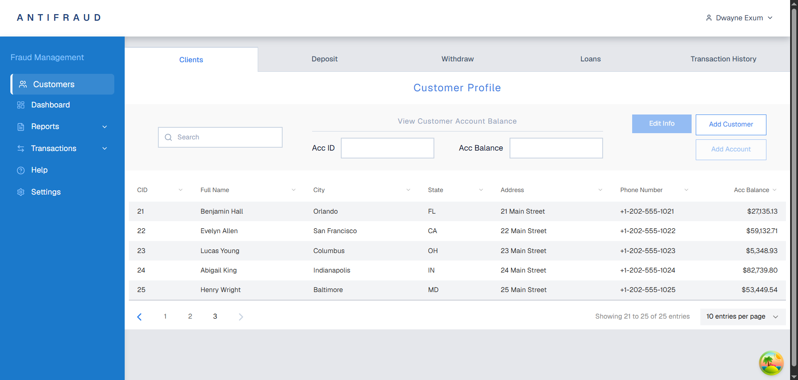

# Customers Page Requirements

## User Story

As a fraud management operator,

I want to browse customers, search for a specific customer, and navigate through pages of customer records.

---

## API Calls

### Get Customers

GET `/customers`

Returns:

- customers list;
- account balance for each customer;
- account status;
- total number of customers;
- pagination information.

Supports:

- server-side pagination;
- server-side search.

API provider:

- Supabase

---

## User Interface

Reference:



---

## Acceptance Criteria

### AC-1

Customers page is available at:

```text
/customers
```

The home route:

```text
/
```

redirects to:

```text
/customers
```

---

### AC-2

User can browse customers.

#### AC-2.1

Customers are displayed in a table.

#### AC-2.2

Each table row displays:

- Customer ID;
- Full Name;
- City;
- State;
- Address;
- Phone Number;
- Account Balance.

#### AC-2.3

Customer data is loaded from Supabase.

---

### AC-3

User can search customers.

#### AC-3.1

Search input is displayed above the table.

#### AC-3.2

Search is performed on the server.

#### AC-3.3

Search is debounced.

#### AC-3.4

Search is performed by customer name.

#### AC-3.5

If no customers match the search query, an empty state is displayed.

---

### AC-4

User can navigate through customer pages.

#### AC-4.1

Pagination controls are displayed below the table.

#### AC-4.2

User can change the current page.

#### AC-4.3

User can select the number of displayed rows.

#### AC-4.4

Pagination is performed on the server.

---

### AC-5

Loading and error states are displayed.

#### AC-5.1

Loading state is displayed while customers are being fetched.

#### AC-5.2

API errors are displayed to the user.

---

### AC-6

Customers page layout matches the provided design.

#### AC-6.1

The page contains:

- top navigation;
- customer profile section;
- search field;
- customer actions;
- customers table;
- pagination.

#### AC-6.2

Application header and sidebar remain visible while using the page.
