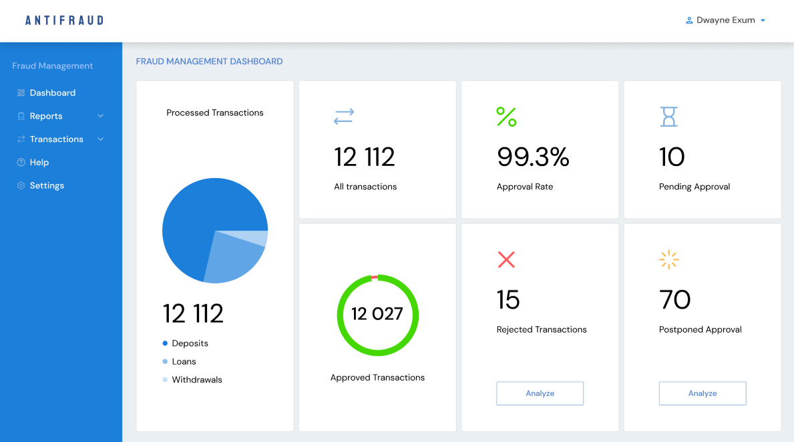

# Dashboard Page Requirements

## User Story

As a fraud management operator,

I want to monitor overall transaction statistics and key fraud metrics from a single dashboard.

---

## API Calls

### Get Dashboard Metrics

Returns:

- processed transactions statistics;
- transaction status distribution;
- dashboard summary metrics;
- monthly transaction statistics.

API provider:

- Supabase

---

## User Interface

Reference:



---

## Acceptance Criteria

### AC-1

Dashboard page is available at:

```text
/dashboard
```

---

### AC-2

Dashboard displays overall transaction statistics.

#### AC-2.1

A pie chart displays processed transactions grouped by:

- Deposits;
- Loans;
- Withdrawals.

#### AC-2.2

The total number of processed transactions is displayed below the chart.

#### AC-2.3

Pie chart data is loaded from Supabase.

---

### AC-3

Dashboard displays summary metric cards.

#### AC-3.1

The page contains six metric cards.

#### AC-3.2

Cards display:

- All Transactions;
- Approval Rate;
- Pending Approval;
- Approved Transactions;
- Rejected Transactions;
- Postponed Approval.

#### AC-3.3

Each card displays:

- icon;
- metric value;
- metric label.

#### AC-3.4

Approved Transactions card displays a circular progress chart.

#### AC-3.5

Rejected Transactions and Postponed Approval cards display an Analyze button.

#### AC-3.6

Analyze buttons are placeholders for future functionality.

---

### AC-4

Dashboard displays transaction activity.

#### AC-4.1

A line chart displays transactions per month.

#### AC-4.2

Chart is rendered using Shadcn UI chart components.

#### AC-4.3

Chart data is loaded from Supabase.

---

### AC-5

Loading, empty, and error states provide user feedback.

#### AC-5.1

Loading state is displayed while dashboard data is being fetched.

#### AC-5.2

API errors are displayed to the user.

#### AC-5.3

Charts display an empty state when no data is available.

---

### AC-6

Dashboard layout matches the provided design.

#### AC-6.1

The page contains:

- application header;
- sidebar;
- dashboard title;
- processed transactions pie chart;
- six summary cards;
- monthly transactions line chart.

#### AC-6.2

Application header and sidebar remain visible while using the dashboard.

#### AC-6.3

Dashboard layout is responsive for desktop and mobile devices.
