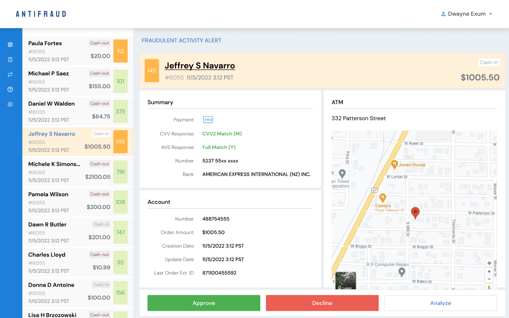

# Transactions Page Requirements

## User Story

As a fraud management operator,

I want to review suspicious transactions, inspect detailed transaction information, and quickly analyze transaction context before making a decision.

---

## API Calls

### Get Transactions

Returns:

- transaction list;
- customer information;
- account information;
- transaction details;
- ATM address.

API provider:

- Supabase

---

## User Interface

Reference:



---

## Acceptance Criteria

### AC-1

Transactions page is available at:

```text
/transactions
```

---

### AC-2

The page displays a list of transactions.

#### AC-2.1

Transactions are displayed in a vertical list.

#### AC-2.2

Each transaction item displays:

- customer name;
- customer ID;
- transaction date and time;
- transaction amount;
- transaction type;
- fraud score.

#### AC-2.3

Transaction list data is loaded from Supabase.

#### AC-2.4

The first transaction is selected by default.

#### AC-2.5

Selecting another transaction updates the details panel.

---

### AC-3

The page displays detailed information about the selected transaction.

#### AC-3.1

Transaction details include:

- customer information;
- account information;
- transaction amount;
- transaction date;
- ATM address.

#### AC-3.2

Additional payment verification information is displayed as mock data:

- payment provider;
- CVV response;
- AVS response;
- masked card number;
- bank name.

#### AC-3.3

Missing backend data is represented using mock values.

---

### AC-4

The page displays the transaction location.

#### AC-4.1

A map displays the ATM location.

#### AC-4.2

The map automatically updates when another transaction is selected.

#### AC-4.3

The map location is determined from the transaction ATM coordinates.

#### AC-4.4

The map is implemented using React Leaflet and OpenStreetMap.

---

### AC-5

The page provides transaction action buttons.

#### AC-5.1

The following action buttons are displayed:

- Approve;
- Decline;
- Analyze.

#### AC-5.2

Buttons are placeholders for future functionality.

---

### AC-6

Loading, empty, and error states provide user feedback.

#### AC-6.1

Loading state is displayed while transaction data is being fetched.

#### AC-6.2

API errors are displayed to the user.

#### AC-6.3

An empty state is displayed when no transactions are available.

---

### AC-7

Transaction Review layout matches the provided design.

#### AC-7.1

The page contains:

- application header;
- collapsible sidebar;
- transaction list;
- transaction details panel;
- transaction location map;
- transaction action buttons.

#### AC-7.2

Application header remains visible while using the page.

#### AC-7.3

Sidebar is displayed in collapsed mode.

#### AC-7.4

The layout is responsive for desktop and mobile devices.
